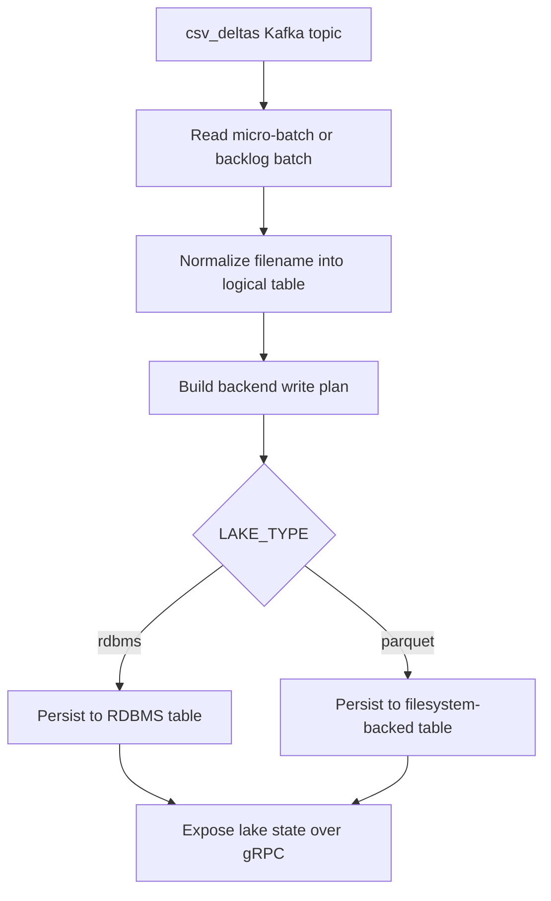
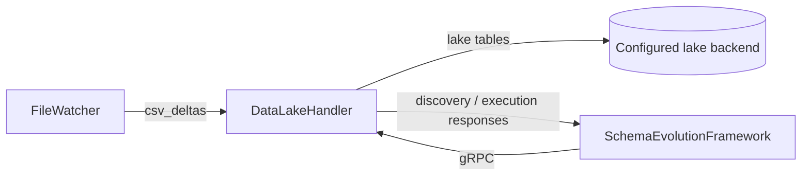

# DataLakeHandler

DataLakeHandler consumes row-level file deltas from Kafka and persists them to the configured lake backend. In this stack the service can write to an RDBMS-backed lake or to a filesystem-backed parquet/delta-style lake, and it also exposes a gRPC surface used by SchemaEvolutionFramework during execution and verification.

## Responsibilities

- Consume `csv_deltas` events from Kafka.
- Group incoming records by logical table name.
- Normalize table names into backend-safe physical identifiers.
- Persist rows into the configured lake backend.
- Expose lake-side gRPC operations for SchemaEvolutionFramework.

## Architecture

### Mermaid processing flow




The production-ready refactor follows a functional-core / imperative-shell layout.

- `domain/` contains pure rules such as table-name normalization and batching.
- `core/` contains ingestion orchestration and streaming/bulk execution.
- `helper/` contains Spark, Kafka, and storage adapters.
- `utils/` contains compatibility helpers and backend-specific lake utilities.
- `docs/` contains architecture and function-level documentation.

## Runtime interfaces

### Inputs
- Kafka topic: `csv_deltas`
- gRPC requests from SchemaEvolutionFramework

### Outputs
- RDBMS tables when `LAKE_TYPE=rdbms`
- filesystem-backed tables when `LAKE_TYPE=parquet`
- gRPC responses for discovery, execution, and verification

## Configuration

The primary configuration source is the repo-local `.env` file. It is loaded at runtime and should be versioned separately from environment-specific secrets.

Key groups in `.env`:

### Storage and backend mode
- `LAKE_TYPE` selects the backend mode: `rdbms` or `parquet`.
- `DELTA_PATH`, `CHECKPOINT_PATH`, and `HOST_DATA_DIRECTORY` control persisted data and checkpoints.
- `POSTGRES_*` controls the RDBMS lake connection when `LAKE_TYPE=rdbms`.

### Kafka
- `KAFKA_BOOTSTRAP_SERVERS`
- `KAFKA_TOPIC`
- `KAFKA_GROUP_ID`
- `KAFKA_STARTING_OFFSETS`
- `BACKLOG_BATCH_SIZE`

### Processing mode
- `PROCESSING_MODE` selects `streaming` or `bulk`.
- `SCHEDULE_TYPE`, `SCHEDULE_CRON`, and `SCHEDULE_INTERVAL_HOURS` control scheduled bulk execution.

### Spark
- `SPARK_MASTER`
- `SPARK_DRIVER_MEMORY`, `SPARK_EXECUTOR_MEMORY`
- `SPARK_DRIVER_CORES`, `SPARK_EXECUTOR_CORES`
- `SPARK_DYNAMIC_ALLOCATION*`
- `SPARK_SQL_*`

## Environment variables

Keep deployment-specific secrets and hostnames in the environment. Keep operational defaults in the application configuration and override them only when needed.

### Required environment variables

Set these values explicitly for every deployment.

```dotenv
# Backend mode
LAKE_TYPE=rdbms
DELTA_PATH=/data/lake
CHECKPOINT_PATH=/tmp/datalake/checkpoints

# Kafka
KAFKA_BOOTSTRAP_SERVERS=kafka:9092
KAFKA_TOPIC=csv_deltas
KAFKA_GROUP_ID=datalake-handler

# RDBMS lake mode
POSTGRES_HOST=postgres
POSTGRES_PORT=5432
POSTGRES_DB=datalake
POSTGRES_USER=postgres
POSTGRES_PASSWORD=change_me
POSTGRES_SCHEMA=public
```

### Optional overrides

Only set these when the deployment needs behavior different from the built-in defaults.

```dotenv
HOST_DATA_DIRECTORY=./data
KAFKA_STARTING_OFFSETS=latest
BACKLOG_BATCH_SIZE=1000

PROCESSING_MODE=streaming
SCHEDULE_TYPE=interval
SCHEDULE_CRON=0 */6 * * *
SCHEDULE_INTERVAL_HOURS=6

SPARK_MASTER=local[*]
SPARK_DRIVER_MEMORY=2g
SPARK_EXECUTOR_MEMORY=2g
SPARK_DRIVER_CORES=1
SPARK_EXECUTOR_CORES=1
```

## Data flow

### Mermaid data-flow diagram




1. FileWatcher publishes appended CSV rows to `csv_deltas`.
2. DataLakeHandler consumes row events and derives the logical table name from the source filename.
3. The write planner resolves the backend-specific physical table name.
4. Records are persisted to the selected lake backend.
5. SchemaEvolutionFramework can then introspect or execute lake operations over gRPC.

## Operations

### Local run
```bash
pip install -r requirements.txt
python main.py
```

### Docker Compose
```bash
docker compose up --build
```

## Licensing model

This repository is licensed under the Apache License, Version 2.0. You may use, modify, and distribute the code in accordance with the terms in `LICENSE`. Any deployment-specific data, secrets, and infrastructure configuration remain outside the scope of the code license.
